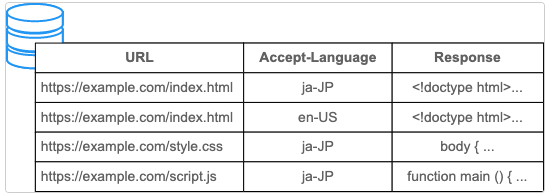

# HTTP Cache

[https://developer.mozilla.org/en-US/docs/Web/HTTP/Caching](https://developer.mozilla.org/en-US/docs/Web/HTTP/Caching)

## Expires

在 HTTP/1.0 中，有效期是通过 `Expires` 标头来指定的, 由于 HTTP/1.1 已被广泛使用，无需特地提供 `Expires`

```bash
Expires: Tue, 28 Feb 2022 22:22:22 GMT
```

::: warning 
1. 时间格式难以解析
2. 有可能通过故意偏移系统时钟来诱发问题
3. 如果 `Expires` 和 `Cache-Control: max-age` 都可用，则将 `max-age` 定义为首选。
:::


## CacheControl

### Client

| Key                 | Description |
| :------------------ | ----------: |
| max-age=`<seconds>`   |  设置缓存存储的最大周期，超过这个时间缓存被认为过期 (单位秒)。与`Expires`相反，时间是相对于请求的时间           |
| max-stale=`<seconds>` | 表明客户端愿意接收一个已经过期的资源。可以设置一个可选的秒数，表示响应不能已经过时超过该给定的时间。            |
| min-fresh=`<seconds>` | 表示客户端希望获取一个能在指定的秒数内保持其最新状态的响应。            |
| no-cache            |   在发布缓存副本之前，强制要求缓存把请求提交给原始服务器进行验证 (协商缓存验证)。          |
| no-store            |  缓存不应存储有关客户端请求或服务器响应的任何内容，即不使用任何缓存。           |
| no-transform        | 不得对资源进行转换或转变。`Content-Encoding`、`Content-Range`、`Content-Type`等 HTTP 头不能由代理修改。例如，非透明代理或者如Google's Light Mode可能对图像格式进行转换，以便节省缓存空间或者减少缓慢链路上的流量。`no-transform`指令不允许这样做。            |
| only-if-cached      |  表明客户端只接受已缓存的响应，并且不要向原始服务器检查是否有更新的拷贝。           |

### Server

| Key                 | Description |
| :-----------------  | -----------------: |
| must-revalidate |一旦资源过期（比如已经超过max-age），在成功向原始服务器验证之前，缓存不能用该资源响应后续请求。 |
| no-cache | 在发布缓存副本之前，强制要求缓存把请求提交给原始服务器进行验证 (协商缓存验证) |
| no-store |缓存不应存储有关客户端请求或服务器响应的任何内容，即不使用任何缓存。 |
| no-transform | 不得对资源进行转换或转变。`Content-Encoding`、`Content-Range`、`Content-Type`等 HTTP 头不能由代理修改。例如，非透明代理或者如Google's Light Mode可能对图像格式进行转换，以便节省缓存空间或者减少缓慢链路上的流量。`no-transform`指令不允许这样做。|
| public | 表明响应可以被任何对象（包括：发送请求的客户端，代理服务器，等等）缓存，即使是通常不可缓存的内容。（例如：1.该响应没有 `max-age` 指令或 `Expires` 消息头；2. 该响应对应的请求方法是 `POST` 。） |
| private | 表明响应只能被单个用户缓存，不能作为共享缓存（即代理服务器不能缓存它）。私有缓存可以缓存响应内容，比如：对应用户的本地浏览器。 |
| proxy-revalidate | 与 `must-revalidate` 作用相同，但它仅适用于共享缓存（例如代理），并被私有缓存忽略。|
| max-age=`<seconds>` |设置缓存存储的最大周期，超过这个时间缓存被认为过期 (单位秒)。与Expires相反，时间是相对于请求的时间 |
| s-maxage=`<seconds>` |覆盖max-age或者Expires头，但是仅适用于共享缓存 (比如各个代理)，私有缓存会忽略它 |

### Experimental

|Key| Descriptions |
|:--|--:|
|[immutable](https://bitsup.blogspot.com/2016/05/cache-control-immutable.html) |表示响应正文不会随时间而改变。资源（如果未过期）在服务器上不发生改变，因此客户端不应发送重新验证请求头（例如`If-None-Match`或 `If-Modified-Since`）来检查更新，即使用户显式地刷新页面。在 Firefox 中，`immutable` 只能被用在 `https://`的事务中|
|stale-while-revalidate=`<seconds>` |表明客户端愿意接受陈旧的响应，同时在后台异步检查新的响应。秒值指示客户愿意接受陈旧响应的时间长度。|
|stale-if-error=`<seconds>` |表示如果新的检查失败，则客户愿意接受陈旧的响应。秒数值表示客户在初始到期后愿意接受陈旧响应的时间。|

### Example

#### 禁止缓存

```bash
Cache-Control: no-store
```

#### 缓存静态资源

```bash
Cache-Control:public, max-age=31536000
```

#### 需要重新验证

指定 `no-cache` 或 `max-age=0, must-revalidate` 表示客户端可以缓存资源，每次使用缓存资源前都必须重新验证其有效性。这意味着每次都会发起 HTTP 请求，但当缓存内容仍有效时可以跳过 HTTP 响应体的下载。

```bash
Cache-Control: no-cache
# OR
Cache-Control: max-age=0, must-revalidate
```

::: warning 注意
如果服务器关闭或失去连接，下面的指令可能会造成使用缓存。

```bash
Cache-Control: max-age=0, must-revalidate #// [!code --]
Cache-Control: max-age=0 #// [!code ++]
```
:::


### Validation

|KEY| COMPARE   |
|:--|--:|
|`ETag`|`If-None-Match`|
|`Last-Modified`|`If-Modified-Since`|

`ETag` > `Last-Modified`


#### Example

##### Last-Modified/If-Modified-Since

::: code-group

```bash [Fresh]
# 以下响应在 22:22:22 生成，max-age 为 1 小时，因此你知道它在 23:22:22 之前是有效的。

HTTP/1.1 200 OK
Content-Type: text/html
Content-Length: 1024
Date: Tue, 22 Feb 2022 22:22:22 GMT
Last-Modified: Tue, 22 Feb 2022 22:00:00 GMT
Cache-Control: max-age=3600

<!doctype html>
…
```
```bash [Stale]
# 到 23:22:22 时，响应会过时并且不能重用缓存。因此，下面的请求显示客户端发送带有 If-Modified-Since 请求标头的请求，以询问服务器自指定时间以来是否有任何的改变。

HTTP
Copy to Clipboard
GET /index.html HTTP/1.1
Host: example.com
Accept: text/html
If-Modified-Since: Tue, 22 Feb 2022 22:00:00 GMT
```

:::

##### ETag/If-None-Match

举个例子，如果 ETag 标头使用了 hash 值，index.html 资源的 hash 值是 deadbeef，响应如下：

```bash
HTTP/1.1 200 OK
Content-Type: text/html
Content-Length: 1024
Date: Tue, 22 Feb 2022 22:22:22 GMT
ETag: "deadbeef"
Cache-Control: max-age=3600

<!doctype html>
…
```


::: warning 备注
在评估如何使用 `ETag` 和 `Last-Modified` 时，请考虑以下几点：在缓存重新验证期间，如果 `ETag` 和 `Last-Modified` 都存在，则 `ETag` 优先。因此，如果你只考虑缓存，你可能会认为 `Last-Modified` 是不必要的。

然而，`Last-Modified` 不仅仅对缓存有用；相反，它是一个标准的 HTTP 标头，内容管理 (CMS) 系统也使用它来显示上次修改时间，由爬虫调整爬取频率，以及用于其他各种目的。

所以考虑到整个 HTTP 生态系统，最好同时提供 `ETag` 和 `Last-Modified`。
:::


## 启发式缓存(Heuristic caching)

HTTP 旨在尽可能多地缓存，因此即使没有给出 `Cache-Control`，如果满足某些条件，响应也会被存储和重用。这称为启发式缓存。

```bash
HTTP/1.1 200 OK
Content-Type: text/html
Content-Length: 1024
Date: Tue, 22 Feb 2022 22:22:22 GMT
Last-Modified: Tue, 22 Feb 2021 22:22:22 GMT

<!doctype html>
…
```

试探性地知道，整整一年没有更新的内容在那之后的一段时间内不会更新。因此，客户端存储此响应（尽管缺少 `max-age`）并重用它一段时间。复用多长时间取决于实现，但规范建议存储后大约 10%（在本例中为 0.1 年）的时间。

启发式缓存是在 `Cache-Control` 被广泛采用之前出现的一种解决方法，基本上所有响应都应明确指定 `Cache-Control` 标头。


## Vary 响应

例如，对于带有 `Accept-Language: en` 标头并已缓存的英语内容，不希望再对具有 `Accept-Language: ja` 请求标头的请求重用该缓存响应。在这种情况下，你可以通过在 Vary 标头的值中添加 `Accept-Language`，根据语言单独缓存响应。

```bash
Vary: Accept-Language
```

