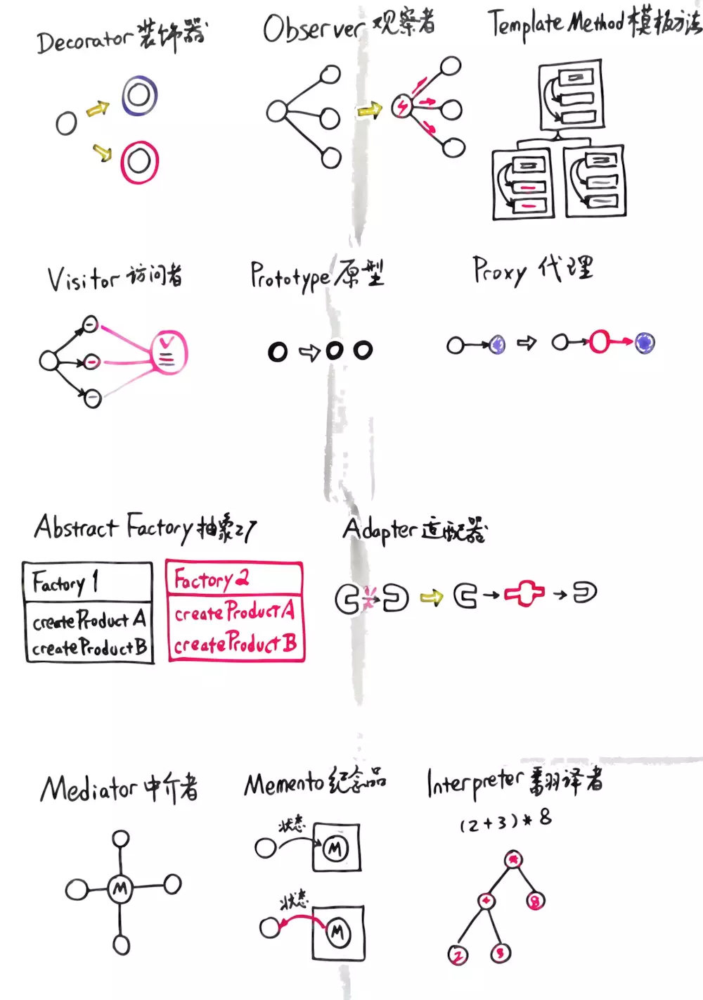
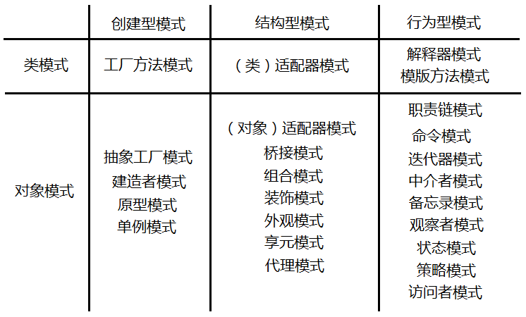

# 设计模式（js）

提示：`这种模式` 表示此模式在js中使用场景不多或者不重要。

## 创建类型设计模式

### [构造器模式/Constructor](./constructor.md)
> 关键词：使用原型/类，替代重复的对象创建操作

### [原型模式/Prototype](./proto.md)
> 将共用的属性/函数，挂载到原型中，免于每次new对象时，都将公用的部分复制一份到实例中

### [构建者/创建者/创造者 模式/Builder](./builder.md)
> 对象的结构不变的情况下，需要在创建对象前，进行各种中间层处理时，可以使用创建者模式，交由创建者统一管理创建（统一管理后，便于统计/验证/管理）

### [工厂模式/Factory](./factory.md)
> 根据入参的不同，创建**部分参数不同**的对象或者**不同类型的对象**（ 根据需求生成不同的对象 ）

### [抽象工厂模式/Abstract](./AbstractFactory.md)
> 根据参数，需要哪个工厂返回哪个工厂，由调用方决定合何时使用工厂（不生产对象，返回工厂）

### [单例模式/Singleton](./singleton.md)
> new对象时返回同一个对象，
1. 闭包
2. 对象挂载到对象中而非方法中 

----

## 结构型设计模式

### [装饰器模式/Decorator](./Decorator.md)
> 为对象添加新功能，并且不改变原有的结构和功能

### [`外观模式(门面模式)/Facede`](./Facade.md)
> 外观模式在javascript中的使用场景并不多。外观模式主要是为子系统中的一组接口提供一个一致的界面，外观模式定义了一个高层接口，这个接口使子系统更容易使用

### [享元模式/Flyweight](./Flyweight.md)
> 享元模式是一种用于性能优化的模式（主要考虑内存，而非效率），"fly"在这里是苍蝇的意思，意为蝇量级。享元模式的核心是运用共享技术来有效支持大量细粒度的对象。

### [适配器模式/Adaptor](./Adaptor.md)
> 适配器模式的作用时解决两个软件实体间的接口不兼容的问题。使用适配器模式后，原本由于接口不兼容而不能工作的两个软件实体可以一起工作。 

### [代理模式/Proxy](./proxy.md)
> 为对象提供一个代用品或者占位符，以便控制对它的访问

### 桥接模式

### [组合模式](./Composite.md)
> 组合模式就是用小的子对象来构建更大的对象。如树结构

----

## 行为型设计模式

### [`解释器模式/Interpreter`](./Interpreter.md)
> 描述语言语法如何定义，如何解释和编译

### [模板方法模式](./TemplateMethod.md)
> 模板方法模式由两部分结构组成，第一部分是抽象父类，第二部分是具体的实现子类。`通常在抽象父类中封装了子类的算法框架`。在模板方法模式中，子类实现中的相同的部分被上移到父类中，而将不同的部分留待子类来实现。体现了泛化的思想。

### [职责链模式](./ChainofResponsibility.md)
> 职责链模式的定义是：使多个对象都有机会处理请求，从而避免请求的发送者到接收者之间的耦合关系，将这些对象连成一条链，并沿着这条链传递该请求，直到有一个对象处理它为止。

### [命令模式](./command.md)
> 命令模式是一种松耦合的方式，将发布者和执行者分离。命令模式中的命令指的是一个执行某些特定事情的指令

### [迭代器模式（Iterator）](./iterator.md)
> 提供一种方法顺序访问一个集合对象中的各个元素，而又不需要暴露该对象的内部表示。使用迭代器模式后，即使不关心对象的内部构造，也能按顺序访问其中的每个元素

### [`中介者（Mediator）`](./mediator.md)
> 通过一个中间对象，使对象之间多对多的管理变成一对多的关系。

### 备忘录模式

### [观察者模式|发布订阅模式（Observer|Pub/Sub）](./pub&sub.md)
> 本模式又称为**观察者模式**，它定义**对象间的一种一对多的依赖关系**，当一个对象的状态发生改变时，所有依赖于它的对象都将得到通知

### [状态机模式（State Machine）](./stateMachine.md)
>状态模式的关键是区分事物内部的状态，事物内部状态的改变往往会带来事物的行为改变

### [策略模式（Strategy）](./Strategy.md)
> 定义一系列的算法，将他们封装起来，并且使他们可以相互替换。处理掉大量的ifElse/switchCase

### [访问者模式（Visitor）](./visitor.md)
> 将数据结构和数据操作进行分离,使用场景不多

---

# 图解

<!--  -->

<!--  -->

# 文字解释
分类：
<!--  -->

<!--  -->

创建模式：单件模式、工厂模式、抽象工厂模式、生成器模式、原型模式。

结构模式：适配器模式、桥接模式、组成模式、装饰模式、外观模式、享元模式、代理模式。

行为模式：中介者模式、命令模式、备忘录模式、状态模式、策略模式、解释器模式、迭代器模式、观察者模式、访问者模式、模板方法模式。

 

**第一类**：

1. 单件模式(Singleton Pattern):
    > 保证一个类仅有一个实例，并提供一个访问它的全局访问点。
    - 例：跨窗体访问同一个实例。
2. 工厂模式(Factory Pattern):
    > 根据提供给工厂的数据，从一系列相关的类中选择一个类实例并返回。
    - 例:Oracle,SQL Server 访问类的选择
3. 抽象工厂模式(Abstract Factory Pattern):
    > 为一组类返回一个工厂。
4. 生成器模式(Builder Pattern):
    > 根据提供给他的数据及表示，组装成新的对象。 
    - 例：根据用户不同的选择显示不同控件。
5. 原型模式(Prototype Pattern):
    > 由结果到一个新的结果。
    - 例：根据由执行的SQL 查询结果得到另一个结果。
    - 与生成器类似工厂，两者都返回由许多方法的对象组成的类。
    - 差别:抽象工厂返回一系列相关的类。
    - 生成器是根据提供给它的数据一步一步地构建一个复杂的对象。

**第二类**:

1. 适配器模式(Adapter Pattern):
    > 将一个类将一种接口转换成另一种接口。
2. 桥接模式(Bridge Pattern):
    > 类的接口和它的实现相分离，无需改变调用者的代码即可替代实现的过程。
3. 组成模式(Composite Pattern):
    > 组合就是对象的结合。可以构建部分-整体的关系或数据的树形关系。
4. 装饰模式(Decorator Pattern):
    > 用一个类包装给定的类改变单个对象的行为，但不需要创建一个新的派生类。
5. 外观模式(Facde Pattern):
    > 可以将一系统复杂的类包装成一个简单的封闭接口。
6. 享元模式(Flyweight Pattern):
    > 通过共享（把参数移动外部）大幅地减少单个实例的数目。
7. 代理模式(Proxy Pattern):
    > 为一个复杂的对象提供一个简单的占位对象。

**第三类**：

1. 中介者模式(Mediator Pattern):
    > 中介者做为唯一了解其它类的一个,简化了通信.促进类之音的松散便于修改维护。
    - 每个和中介者通信的控件都称为同事。
    - 应用:可视界面的程序中，当面临多个对象之间复杂的通信时，可使用。

2. 命令模式(Command Pattern):
    > 只将请求转发给特定的对象。
    - 目的：将程序的界面和操作分离。缺点：增加了散乱的小类

3. 备忘录模式(Memento Pattern):
    > 保存对象的数据以便以后能够恢复它。
    - 发起人(Originator):是一个对象，我们要保存它的状态。
    - 备忘录(Memento):是另外一个对象，它保存了发起人的状态。
    - 负责人(Caretaker):管理状态保存的时机，保存备忘录，并且如果需要的话，使用备忘录恢复发起人的状态。

4. 状态模式(State Pattern):
    > 用一个对象表示程序的状态，并通过转换对象来转换程序的状态。
    - 以前,根据传进来的参数执行不同的计算或显示不同的内容。switch-case/if else状态模式要取代它。

5. 策略模式(Stractegy Pattern):
    > 与状态模式相似,根据需要选择一封装在Context驱动器类。

6. 观察者模式(Observer Pattern):
    > 以多种形式显示数据。在观察者模式中，把数据称为目标(Subject),把每种显示称为观察者(Observer)

7. 解释器模式(Interpreter Pattern):
    > 为某种语言定义一个文法，并用该文法解释语言中的语句。
    
    适用性:
    - 当读者需要一个命令解释器分析用户命令时。
    - 当程序需要分析一个代数串时。
    - 发程序要生成各种形式的输出时。

8. 迭代器模式(Iterator Pattern):
    > 允许使用一个标准的接口顺序访问一个数据列表或集合。

9. 模板方法模式（Template Method Pattern):
    > 先创建一个父类，把其中一个或多个方法留个子类实现。是一种非常简单又常用的模式。思想：将一个类的基本部分抽取出来放到一个基类中，不必重出现在一个派生类中。

10. 职责链(Chain of Responsibility):允许多个类处理同一个请求。
    
    要点：
    - 链的组织是从最特珠的到最一般的。
    - 不能保证在任何情况下都会有响应。
    - 职责链用于分析器与编译器。
