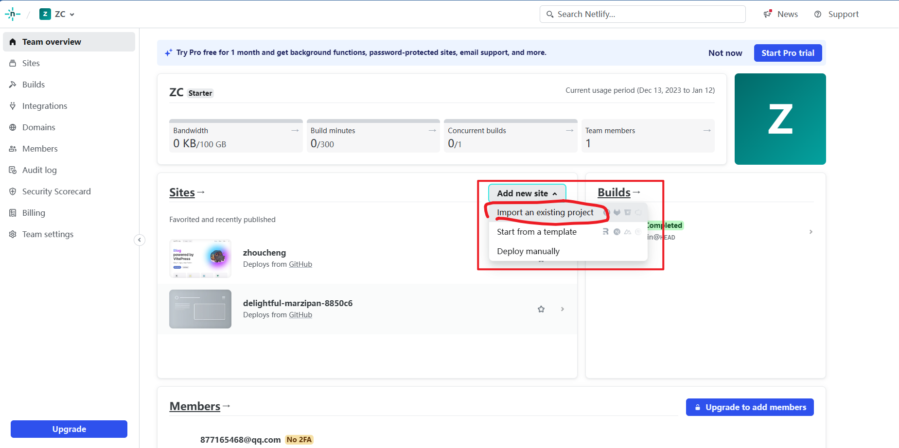
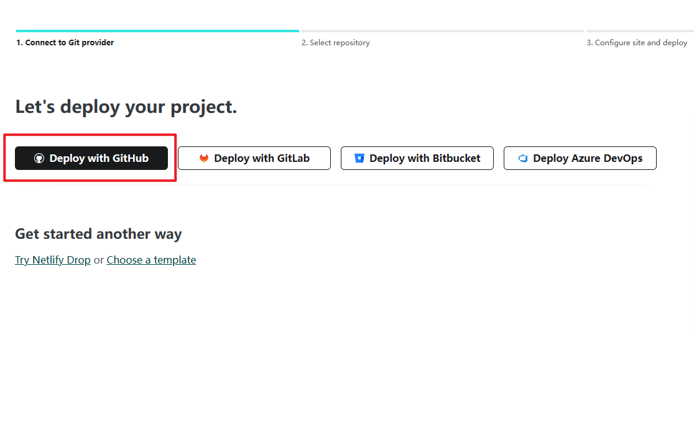
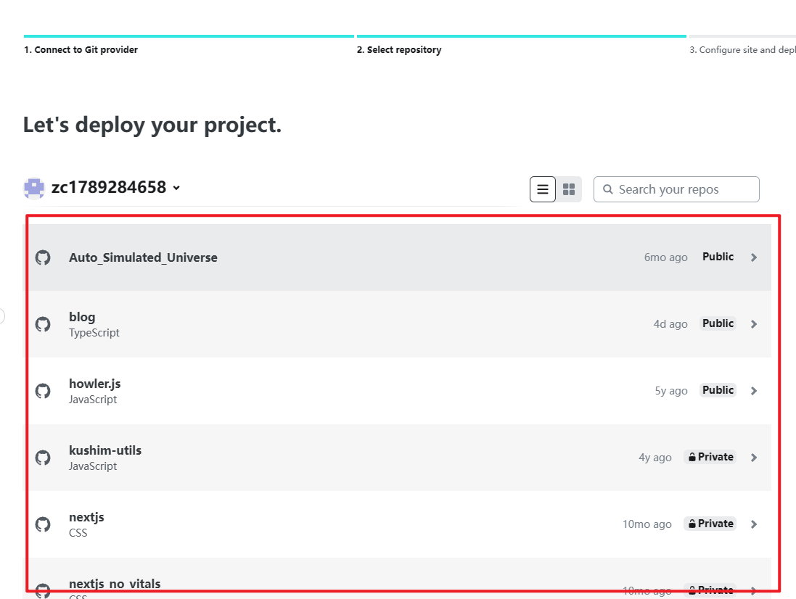
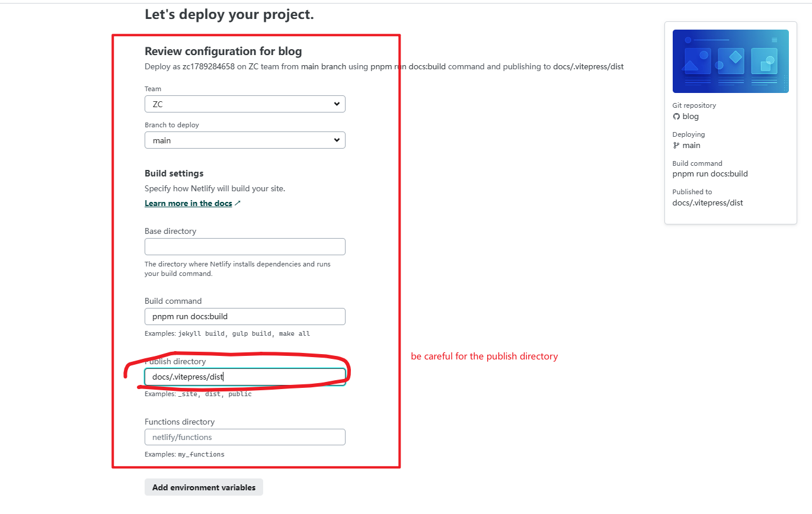
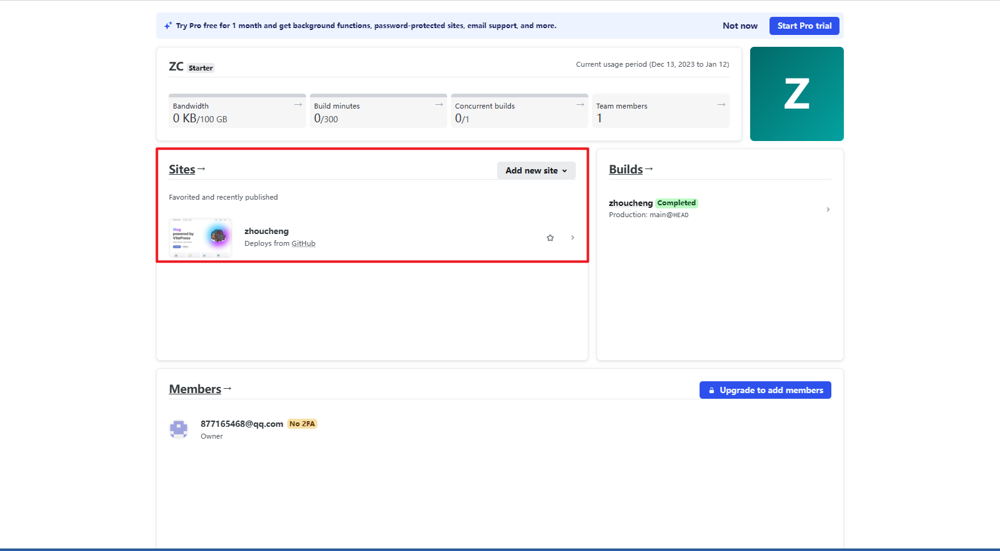
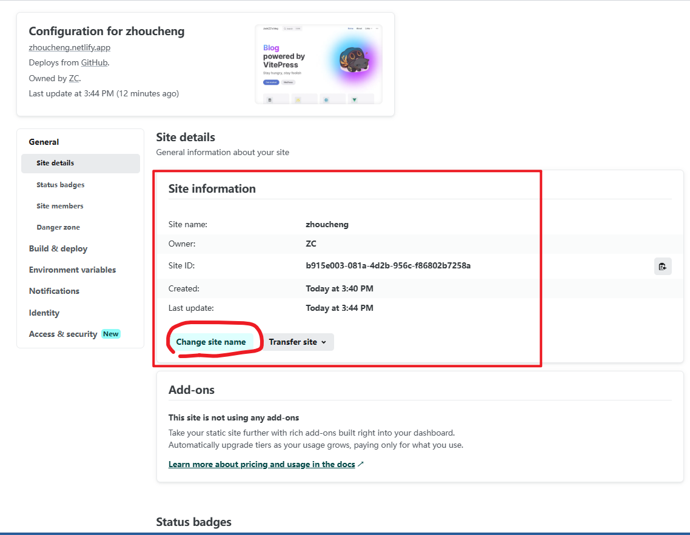
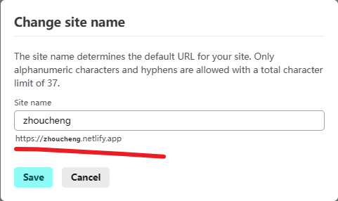

# Deploy by netlify

Use this blog's repo as example

## Sign up

[https://www.netlify.com/](https://www.netlify.com/)

## Add new site

There i import an existing project

## Deploy with github or other

## Select the repo you want deploy

## Configure your deploy

## See your sites

## Modify your sites's domain

Of course, you can modify your sites name to change the domain

## Access your sites

[https://zhoucheng.netlify.app](https://zhoucheng.netlify.app)