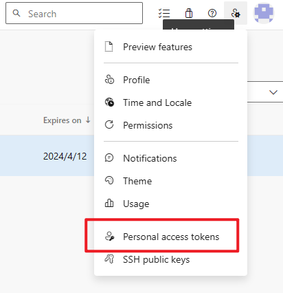
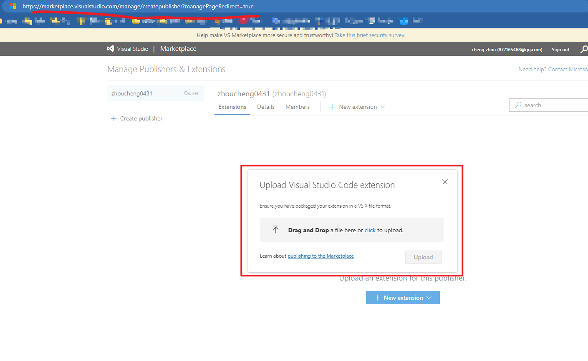

# Build your own Vscode Extensions

## Pre Read

[Vscode Extensions](https://marketplace.visualstudio.com/VSCode)
[Build your own extensions](https://code.visualstudio.com/api)

## Write a extension

please see [the official samples](https://github.com/microsoft/vscode-extension-samples), eg: [snippets samples](https://github.com/microsoft/vscode-extension-samples/tree/main/snippet-sample)

### Your first extension

[https://code.visualstudio.com/api/get-started/your-first-extension](https://code.visualstudio.com/api/get-started/your-first-extension)

```bash
$ npm install -g yo generator-code
$ yo code
```

## Sign up Azure DevOps

注册并登录[`Azure DevOps`](https://azure.microsoft.com/zh-cn/products/devops/)

## Publish extensions

### 注册并登录Azure Devops
[https://code.visualstudio.com/api/working-with-extensions/publishing-extension](https://code.visualstudio.com/api/working-with-extensions/publishing-extension)

### 获取Azure Devops access token



### Install @vscode/vsce

```bash
$ npm install -g @vscode/vsce
```

### Package & Publish

```bash
$ cd myExtension
$ vsce package
# myExtension.vsix generated
$ vsce publish
# <publisher id>.myExtension published to VS Code Marketpl

# log will be like below
# PS E:\work\blog\packages\extensions\vitepress-snippets> vsce publish
#  WARNING  LICENSE, LICENSE.md, or LICENSE.txt not found
# Do you want to continue? [y/N] y
#  WARNING  Failed to open credential store. Falling back to storing secrets clear-text in: C:\Users\zhou\.vsce
# https://marketplace.visualstudio.com/manage/publishers/
# Personal Access Token for publisher 'zhoucheng0431': **************************************************** // [!code warning] 此处需要右键粘贴

# The Personal Access Token verification succeeded for the publisher 'zhoucheng0431'.
#  INFO  Publishing 'zhoucheng0431.vitepress-snippets v1.0.0'...
#  INFO  Extension URL (might take a few minutes): https://marketplace.visualstudio.com/items?itemName=zhoucheng0431.vitepress-snippets
#  INFO  Hub URL: https://marketplace.visualstudio.com/manage/publishers/zhoucheng0431/extensions/vitepress-snippets/hub
#  DONE  Published zhoucheng0431.vitepress-snippets v1.0.0.
```

#### Or publish by ui



## vsce commands

```bash
Usage: vsce <command>

VS Code Extensions Manager
To learn more about the VS Code extension API: https://aka.ms/vscode-extension-api
To connect with the VS Code extension developer community: https://aka.ms/vscode-discussions

Options:
  -V, --version                      output the version number
  -h, --help                         display help for command

Commands:
  ls [options]                       Lists all the files that will be published
  package|pack [options] [version]   Packages an extension
  publish [options] [version]        Publishes an extension
  unpublish [options] [extensionid]  Unpublishes an extension. Example extension id: microsoft.csharp.
  ls-publishers                      List all known publishers
  delete-publisher <publisher>       Deletes a publisher
  login <publisher>                  Add a publisher to the known publishers list
  logout <publisher>                 Remove a publisher from the known publishers list
  verify-pat [options] [publisher]   Verify if the Personal Access Token has publish rights for the publisher.
  show [options] <extensionid>       Show extension metadata
  search [options] <text>            search extension gallery
  help [command]                     display help for command
```