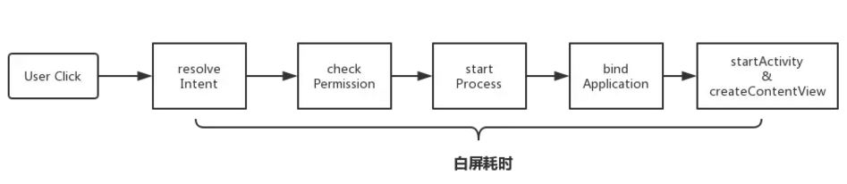
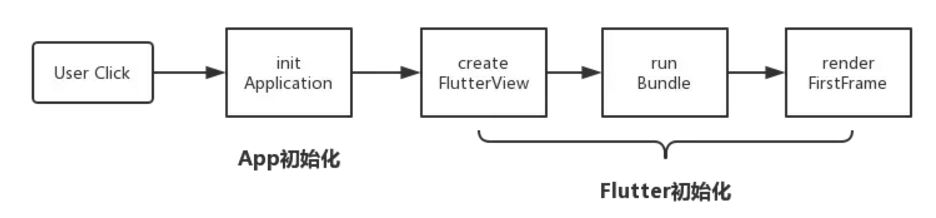
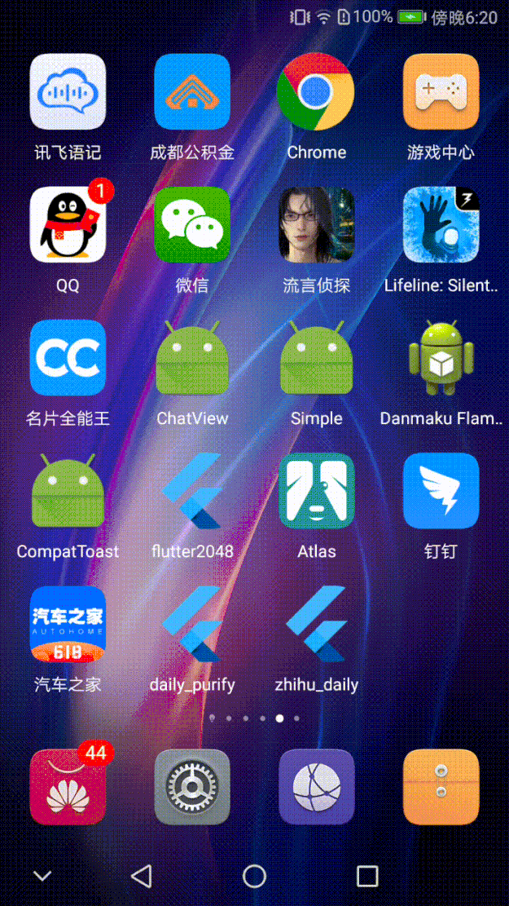
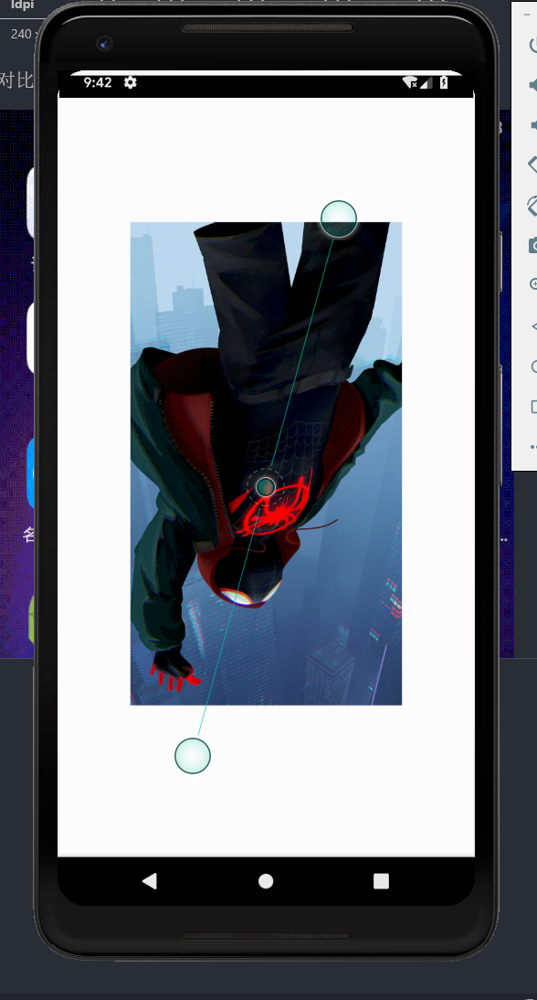
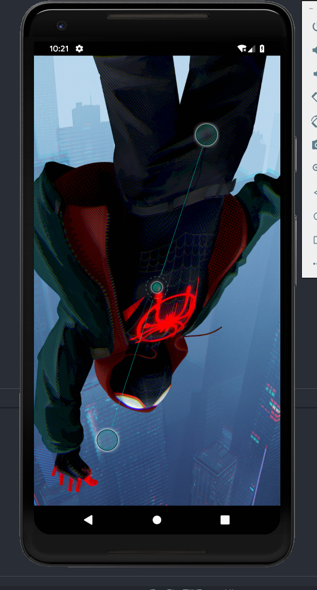
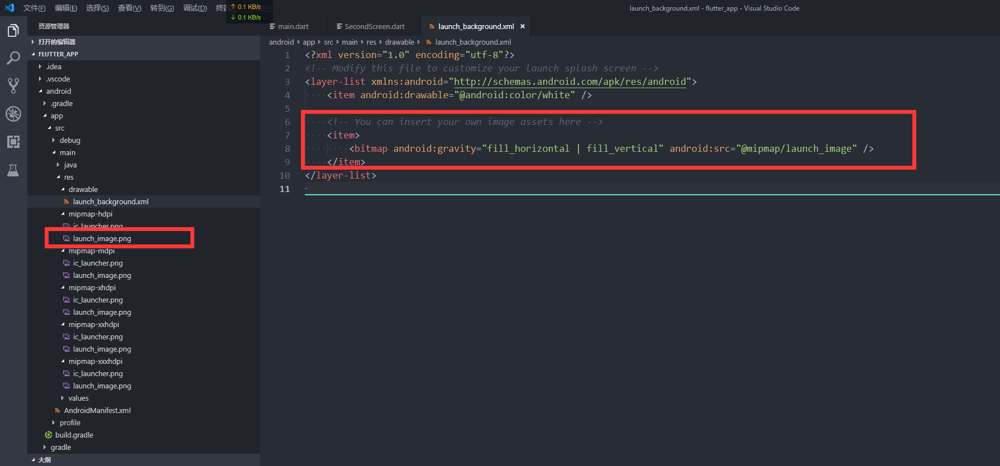

# Flutter闪屏
目录：
- [问题描述](#desc)
- [问题分析](#analy)
- [解决方案](#resolve)
- [配置xml](#setting)
- [各文件夹对应的分辨率](#pixel)
- [前后效果对比](#compare)
## 问题描述 <span id='desc' />
Flutter 应用在 Android 端上启动时会有一段很明显的白屏现象，白屏的时长由设备的性能决定，设备性能越差，白屏时间越长。

## 问题分析 <span id='analy' />
其实启动白屏的问题在Android原生应用上也是一个常见问题，大致是因为从用户点击 Launcher Icon 到应用首页显示之间，Android 系统在完成应用的初始化工作，其流程如下：
<!--  -->


<!--  -->
在 Flutter Android 端上，白屏的问题会更加严重，因为除了 Android 应用启动耗时外，还增加了 Flutter 初始化耗时。


## 解决方案 <span id='resolve' />
Android原生的白屏问题可以通过为 Launcher Activity 设置 windowBackground 解决，而 Flutter 也是基于此办法，同时优化了 Flutter 初始化阶段的白屏问题（覆盖一个launchView），只用两步设置便能解决 Flutter 中白屏问题。

## 配置xml <span id='setting' />
- 打开android\app\src\main\res\drawable\launch_background.xml
- 将<item>里面的内容反注释，并且准备一张图片分辨率1080 x 1920,放入android\app\src\main\res\mipmap-xxhdpi即可。注意名字改成launch_image即可。或者你可以用别的名字，把上面的xml文件改一下即可
    ```xml
    <?xml version="1.0" encoding="utf-8"?>
    <!-- Modify this file to customize your launch splash screen -->
    <layer-list xmlns:android="http://schemas.android.com/apk/res/android">
        <item android:drawable="@android:color/white" />

        <!-- You can insert your own image assets here -->
        <item>
            <bitmap android:gravity="center" android:src="@mipmap/launch_image" />
        </item>
    </layer-list>

    ```
- 

## 各文件夹对应的分辨率 <span id='pixel' />
密度	| ldpi|	mdpi|	hdpi	|xhdpi|	xxhdpi	|xxxhdpi
--|--|--|--|--|--|--
代表分辨率	|240 x 320	|320 x 480	|480 x 800|	720 x 1280|	1080 x 1920|	3840×2160

## 前后效果对比 <span id='compare' />
<!-- 添加闪屏前： -->
添加闪屏前：

<!-- 添加闪屏后： -->
添加闪屏后：
## 问题集锦
- 删除ic_launch，导致编译失败
    1. 方法1：不删除ic_launch文件
    2. 方法2：debug模式中依赖此文件，<!--[将debug模式中的依赖文件进行修改](./images/delete-ic_launcher.png)-->[将debug模式中的依赖文件进行修改](https://raw.githubusercontent.com/zc1789284658/Code-Note/master/flutter/images/delete-ic_launcher.png)

<!-- - [图片比例异常](./images/no-adaptor.png) -->
- [图片比例异常](https://raw.githubusercontent.com/zc1789284658/Code-Note/master/flutter/images/no-adaptor.png)
    1. 方法1： 请根据[各文件夹对应的分辨率](#pixel)设置不同分辨率的图片
    2. 方法2： 如果各分辨率比例差异不大，可以通过设置android:gravity属性进行自适应
    ```xml
    <item>
        <bitmap android:gravity="fill_horizontal | fill_vertical" android:src="@mipmap/launch_image" />
    </item>
    ```
    `闪屏图片分辨率与设备分辨率不匹配时`:

    <!--  -->
    

    `闪屏图片通过android:gravity自适应结果如下`

    <!--  -->
    

- 闪屏图片只能通过xml配置进行更换
    1. 如果应用有文件修改能力，则每次登陆后，从后台获取launcher_image地址后，修改xml，修改完后需要重新登陆
    2. 闪屏使用其他方案

## XML Bitmap属性列表
[点此查看](./xmlBitmap.md)


## 实际文件图示
<!--  -->
