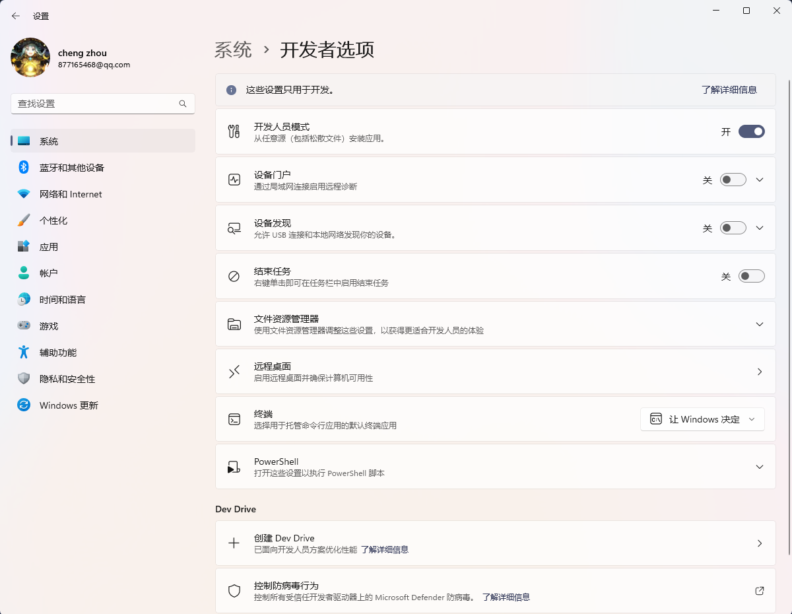
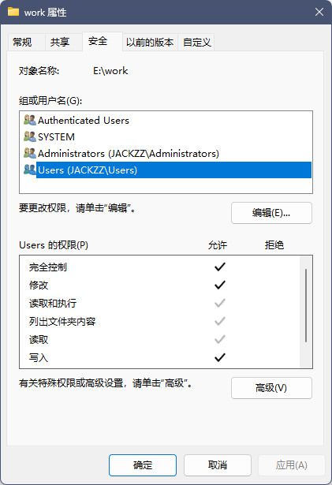

# Grocery

## Pixiv: 请进行reCaptcha验证

> 但是没有相关UI。此时需要将梯子代理设置为全局（`Global`）代理 

## Error: EPERM: operation not permitted

::: details

### Error message

```bash
# vitepress build docs
$ pnpm docs:build
✓ building client + server bundles...
✓ rendering pages...
build error:
Error: EPERM: operation not permitted, unlink 'E:\work\blog\docs\.vitepress\.temp\@localSearchIndexroot.hRzpWETl.js'
```

### 解决

::: details

#### 方案1：开启Windows开发者模式

[issue link](https://github.com/vuejs/vitepress/issues/1209)

> windows11 > 系统 > 开发者选项 > 开发人员模式 （open）



#### 方案2：文件夹权限放开


:::

::: warning
1. 如果你使用的是vscode，修改完需要重新启动shell或者重启vscode（`ctrl+shift+p` -> `>reload`）
2. pnpm docs:dev后，如果产生新文件，可能导致pnpm docs:build失败，需要重启vscode再build
:::