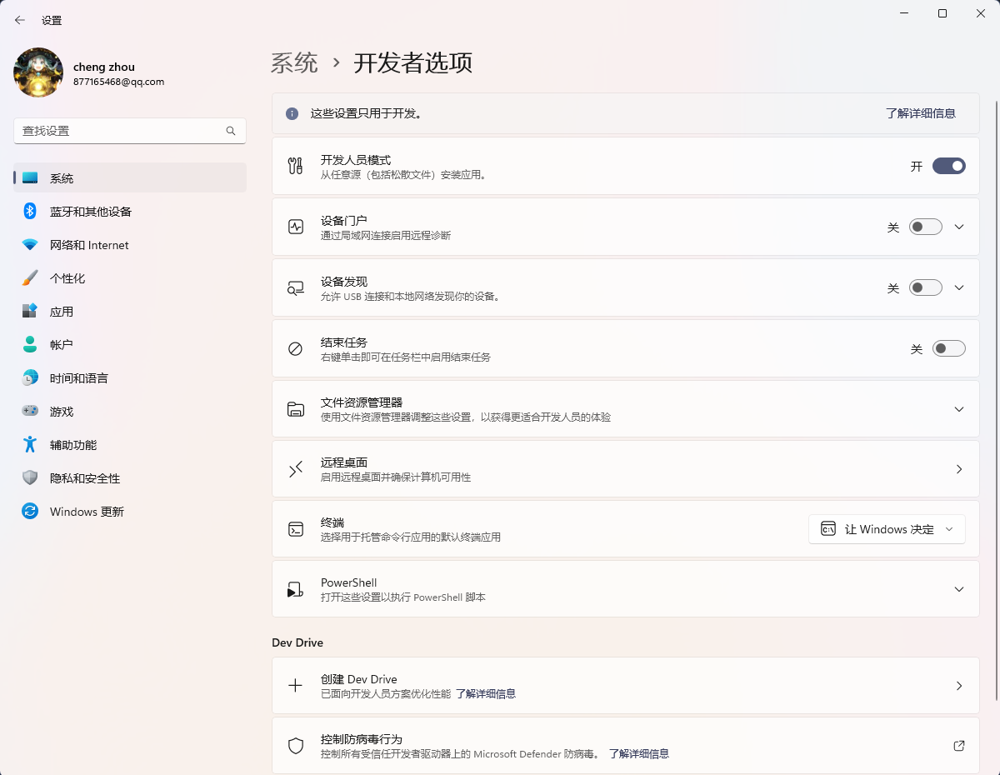

# VitePress

## Error: EPERM: operation not permitted

::: details

### Error message

```bash
# vitepress build docs
$ pnpm docs:build
✓ building client + server bundles...
✓ rendering pages...
build error:
Error: EPERM: operation not permitted, unlink 'E:\work\blog\docs\.vitepress\.temp\@localSearchIndexroot.hRzpWETl.js'
```

### 解决

::: details

#### 方案1：关闭正在运行的`pnpm docs:dev`

`vitepress docs dev`可能会占用文件，导致无法执行`vitepress docs build`

#### 方案2：开启Windows开发者模式

[issue link](https://github.com/vuejs/vitepress/issues/1209)

> windows11 > 系统 > 开发者选项 > 开发人员模式 （open）



#### 方案：文件夹权限放开


:::

::: warning
1. 如果你使用的是vscode，修改完需要重新启动shell或者重启vscode（`ctrl+shift+p` -> `>reload`）
2. pnpm docs:dev后，如果产生新文件，可能导致pnpm docs:build失败，需要重启vscode再build
:::

## features中的`icon.src`在build后不显示

```yaml
// docs/AAA/BBB/C.md // [!code focus]
---
# https://vitepress.dev/reference/default-theme-home-page
layout: home

hero:
  name: "Recomment sites"

features:
  # basic
  - title: Nestjs
    link: https://nestjs.com/
    icon:
      src: ./images/nestjs.svg  # svg文件地址在docs/AAA/BBB/images/nestjs.svg // [!code focus]

---

```

查看build结果，发现无此文件，而md中的链接会正常保存。推测应该是build时，忽略了对`icon.src`进行扫描并保存，导致build后文件丢失，