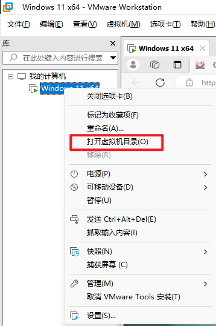

# VMware

## 迁移虚拟机目录

### 1. Copy vm to target dir

如旧目录为`D:\Program Files\Virtual Machines\Windows 11 x64`，复制`D:\Program Files\Virtual Machines`到其他目录，如`E:\Virtual Machines\Windows 11 x64`

### 2. Remove old vm

### 3. Import vm from new dir

path： `FILE > OPEN`, 选择`E:\Virtual Machines\Windows 11 x64\XXXXX.vmx`

## NAT模式下无法联网（宿主win11+wifi）

> 打开`网络适配器`>`当前wifi`>`属性`>`共享`>`VMWARE`

